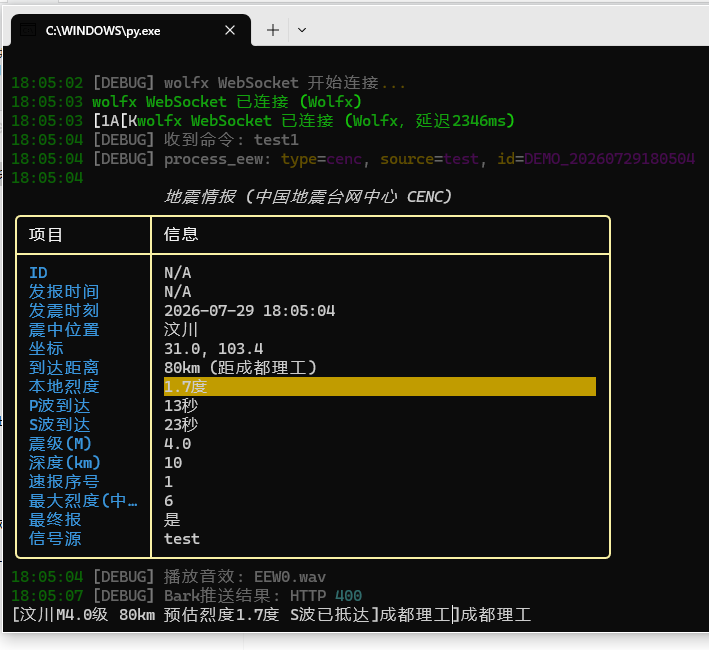

# eew-cli-monitor / 地震预警命令行监控程序

基于 **Wolfx**、**P2PQuake**、**NIED**、**FAN** 数据源的地震预警命令行工具。通过 WebSocket 实时接收地震速报，在终端中以彩色表格展示详细预警信息，并支持声音报警、推送通知、P/S波到达倒计时等功能。



## 数据源

| 数据源 | 类型 | 子源 |
|--------|------|------|
| **Wolfx** | WebSocket | JMA (日本气象厅), CENC (中国地震台网), SC (四川地震局), FJ (福建地震局), CQ (重庆地震局), cenc_eqlist (地震目录) |
| **P2PQuake** | EPSP + JSON API v2 WebSocket | JMA (日本气象厅), 海啸预报, 地震感知情报 |
| **NIED** | WebSocket | 日本防灾科学技术研究所 |
| **FAN Studio** | WebSocket | cea, cwa-eew, jma, cenc, cwa, usgs, sa, emsc, bcsf, gfz, usp, kma, kma-eew, fssn, fssn-cmt, cea-pr, ningxia, guangxi, shanxi, beijing, yunnan, hko, tsunami |
| **FANW** | WebSocket | 中国气象局气象预警 (weatheralarm) |

## 功能特点

- **实时监控** — 通过 WebSocket 持续接收数据，新地震瞬时报出
- **彩色表格** — 使用 `rich` 库在终端中渲染格式化的地震信息表
- **事件去重** — 基于事件ID自动去重，每条地震只提醒一次
- **用户位置** — 配置个人位置，自动计算震中距、本地预估烈度
- **P/S波倒计时** — 动态显示 P 波和 S 波到达倒计时
- **多级预警** — 按预估烈度分三级 (tier1/tier2/tier3)，每级可独立配置
- **声音警报** — 5种 WAV 音效，随预警级别自动切换
- **Windows 通知** — 原生 Toast 弹窗提醒
- **Bark 推送** — 支持 iOS Bark App 推送通知
- **CSV 导出** — 可将地震数据导出为 CSV 文件
- **交互命令** — 运行时动态启用/禁用数据源、子源、切换调试模式等
- **模拟测试** — 内置 4 级模拟地震测试 (M1/M3/M6/M8)
- **配置持久化** — 所有设置自动保存到 `config.json`
- **断线重连** — 各数据源独立自动重连

## 从 Release 下载

前往 [Releases 页面](https://github.com/WangLi0101/eew-cli-monitor/releases) 下载最新版本 `eew-cli-monitor.exe`，下载后双击即可运行（已打包所有依赖和音效文件）。

## 环境要求

- Python 3.7+
- 网络连接

## 安装

### 手动安装

1. 克隆或下载本仓库
2. 安装依赖：
   ```cmd
   pip install -r requirements.txt
   ```
   依赖列表：`requests>=2.25.0`、`rich>=10.0.0`、`websocket-client>=1.6.0`

3. 运行：
   ```cmd
   python eew-cli-monitor.py
   ```

### 打包为独立 exe

```cmd
pyinstaller --onefile --add-data "sounds;sounds" --add-data "geo;geo" --add-data "config.json;." --name "eew-cli-monitor" eew-cli-monitor.py
```

## 配置说明

编辑 `config.json` 进行配置：

| 配置路径 | 字段 | 含义 | 默认值 | 示例 |
|----------|------|------|--------|------|
| `location.name` | 字符串 | 用户位置名称（仅用于显示） | `null` | `"成都理工"` |
| `location.latitude` | 浮点数 | 用户纬度，用于距离/本地烈度计算（可前往 [腾讯位置服务](https://lbs.qq.com/getPoint/) 拾取坐标） | `null` | `30.67` |
| `location.longitude` | 浮点数 | 用户经度 | `null` | `104.14` |
| `sources.<key>.enabled` | 布尔 | 数据源是否启用 | wolfx: true, 其余 false | `true` |
| `sources.<key>.url` | 字符串 | WebSocket 连接地址 | 各源默认 URL | `"wss://ws-api.wolfx.jp/all_eew"` |
| `sources.<key>.fallback_urls` | 字符串数组 | 备用连接地址 | `[]` | `["wss://ws.fanstudio.hk/all"]` |
| `filters.<source>.<subtype>` | 布尔 | 子源开关 | wolfx: jma=false, cenc/sc/fj/cq=true; fan: cenc/ningxia/guangxi/shanxi/beijing/yunnan/fssn=true, 其余 false | `true` |
| `alert.bark_url` | 字符串/null | Bark 推送 URL（在 App Store 安装 Bark App 后获取），留 null 则不推送 | `null` | `"https://api.day.app/YourKey/"` |
| `alert.tiers.tier1` | 对象 | `{min:1.0, max:2.0}` 烈度 1~2 级，windows/bark 均开 | 同上 | `{"min":1.0,"max":2.0}` |
| `alert.tiers.tier2` | 对象 | `{min:2.0, max:3.0}` 烈度 2~3 级，windows/bark 均开 | 同上 | `{"min":2.0,"max":3.0}` |
| `alert.tiers.tier3` | 对象 | `{min:3.0, max:12.0}` 烈度 ≥3 级，windows/bark 均开 | 同上 | `{"min":3.0}` |
| `export_path` | 字符串/null | CSV 导出文件路径，null 则自动生成 | `null` | `"quakes.csv"` |
| `debug` | 布尔 | 调试日志开关 | `false` | `true` |

## 交互命令

程序运行中可直接输入命令：

| 命令 | 说明 |
|------|------|
| `help` | 显示帮助 |
| `test0` ~ `test3` | 模拟 M1/M3/M6/M8 级地震 |
| `debug [on/off]` | 开启/关闭调试模式 |
| `export on/off` | 开启/关闭 CSV 导出 |
| `export path <路径>` | 设置导出文件路径 |
| `list` | 获取中国地震台网目录 |
| `stop <source>` | 停用数据源 (wolfx/p2p/p2pjson/nied/fan/all) |
| `stop <source>/<subtype>` | 停用子源 (如 `stop fan/cenc`) |
| `enable <source>` | 启用数据源 |
| `enable <source>/<subtype>` | 启用子源 |
| `restart <source>` | 重启数据源 |
| `status` | 查看所有数据源及子源状态 |

退出：`Ctrl + C`

## 致谢

- 本程序使用的所有地震预警数据均由 [Wolfx Project](https://wolfx.jp/) , [P2PQuake](https://www.p2pquake.net/) , [NIED](https://www.bosai.go.jp/sp/) , [FAN](https://api.fanstudio.tech/) 提供，感谢他们的无私贡献。
- 感谢 [DeepSeek](https://deepseek.com/) 人工智能助手协助编写、优化和调试本程序代码。
- 感谢[troilus](https://github.com/troilus)对项目的无私贡献

### 说明

- 本人为高中生，能力有限，项目如有错误请谅解，可以向3822104508@qq.com提交错误,本人会尽力解决
   
### 许可证
- 本项目采用 MIT 许可证。
